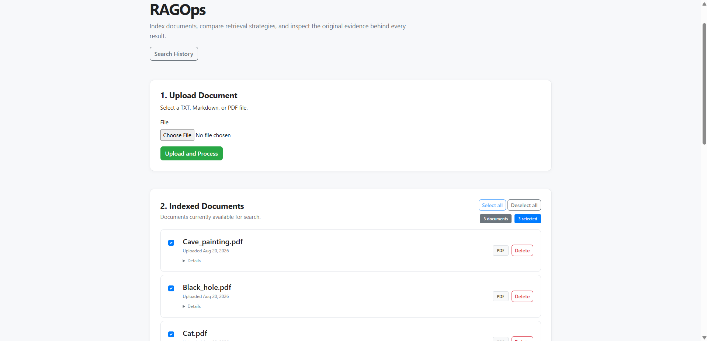
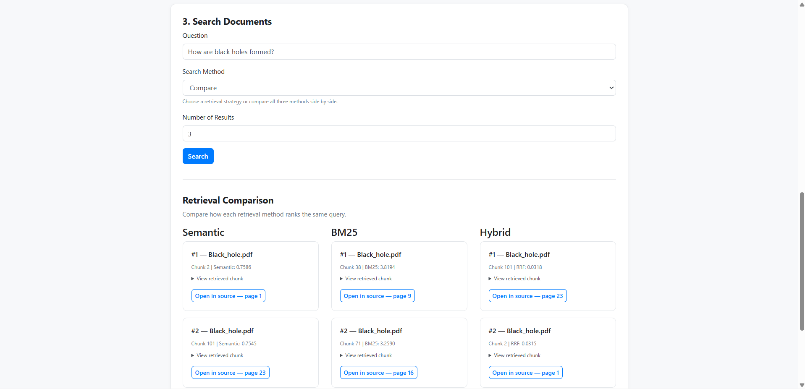
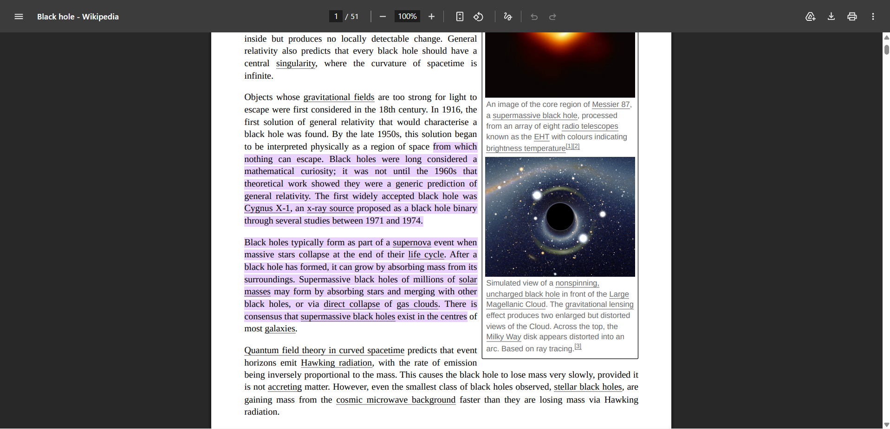

# RAGOps

RAGOps is a local document retrieval system for indexing documents, searching them with different retrieval strategies, and navigating directly from search results to the supporting source text.

The project started as an exploration of Retrieval-Augmented Generation, but its final scope focuses deliberately on the retrieval layer itself: document ingestion, chunking, semantic search, BM25, hybrid retrieval, source navigation, and retrieval evaluation.

RAGOps runs locally without a generative LLM or external AI API.



## What it does

RAGOps lets you:

- Upload `.txt`, `.md`, and `.pdf` documents.
- Extract and clean their text.
- Split documents into overlapping chunks while preserving source positions.
- Generate multilingual embeddings locally with Sentence Transformers.
- Search using Semantic Search, BM25, or Hybrid Search.
- Compare all three retrieval strategies side by side.
- Select which indexed documents should participate in a search.
- Open a result directly in its original source.
- Jump to the relevant PDF page and, where supported by the browser, highlight matching text.
- Manage and delete indexed documents.
- Store search history in SQLite.
- Evaluate retrieval quality against a manually labelled benchmark.

## Why this project

A large part of building a useful RAG system happens before answer generation.

If retrieval returns the wrong evidence, an LLM cannot reliably recover from it.

RAGOps was built to explore that retrieval layer directly and answer questions such as:

- How does semantic retrieval compare with lexical search?
- When does BM25 outperform embeddings?
- Does combining both methods always improve ranking quality?
- How should retrieved chunks remain connected to their original sources?
- How can retrieval quality be measured rather than judged only by intuition?

The result is a retrieval-focused system where the behaviour of each search method can be inspected and evaluated independently.

## Retrieval methods

### Semantic Search

Queries and document chunks are embedded using:

`sentence-transformers/paraphrase-multilingual-MiniLM-L12-v2`

Chunks are ranked by semantic similarity, allowing the system to retrieve relevant passages even when the query uses different wording.

### BM25

BM25 provides lexical retrieval based on term relevance.

It complements semantic search particularly well for factual queries where important terminology appears directly in the source document.

### Hybrid Search

Hybrid Search retrieves candidates using both Semantic Search and BM25 and combines their rankings using Reciprocal Rank Fusion (RRF).

RRF improves retrieval coverage, although the project evaluation also revealed cases where exact-chunk fusion can reduce ranking quality.



## Architecture

```text
                         ┌─────────────────────┐
                         │       Browser       │
                         └──────────┬──────────┘
                                    │
                                    ▼
                         ┌─────────────────────┐
                         │   Express + EJS     │
                         │      Frontend       │
                         └──────────┬──────────┘
                                    │ HTTP
                                    ▼
                         ┌─────────────────────┐
                         │      FastAPI        │
                         │       Backend       │
                         └──────────┬──────────┘
                                    │
                 ┌──────────────────┼───────────────────┐
                 │                  │                   │
                 ▼                  ▼                   ▼
        ┌────────────────┐ ┌────────────────┐ ┌────────────────┐
        │   Ingestion    │ │    Document    │ │     Search     │
        │    Service     │ │    Storage     │ │    Service     │
        └───────┬────────┘ └────────────────┘ └───────┬────────┘
                │                                      │
                ▼                           ┌──────────┼──────────┐
        ┌────────────────┐                  │          │          │
        │ Text Extraction│                  ▼          ▼          ▼
        │  + Chunking    │             Semantic     BM25        Hybrid
        └───────┬────────┘             Search       Search       RRF
                │
                ▼
        ┌────────────────┐
        │ Sentence       │
        │ Transformers   │
        │ Embeddings     │
        └────────────────┘
```

The frontend and backend run as separate processes.

Document files, processed text, chunk metadata, embeddings, and document metadata are stored locally.

## Source navigation

Search results retain metadata linking each chunk back to its original document.

For PDFs, page metadata is preserved during ingestion. Search results can therefore open the original PDF directly at the relevant page.

On browsers supporting Text Fragments, RAGOps also attempts to highlight matching source text.

This highlighting is best-effort: if the browser does not support the feature or the text cannot be matched exactly, the source document still opens normally.



## Retrieval evaluation

RAGOps includes a manually labelled benchmark containing **40 natural-language queries across three documents**.

Each query is evaluated against the complete evaluation corpus rather than being given the document containing its answer.

The benchmark reports:

- Hit@1
- Hit@3
- Hit@5
- MRR@5

### Final results

| Method | Hit@1 | Hit@3 | Hit@5 | MRR@5 |
| --- | ---: | ---: | ---: | ---: |
| Semantic | **0.500** | 0.600 | 0.700 | **0.574** |
| BM25 | 0.450 | **0.625** | 0.700 | 0.545 |
| Hybrid | 0.400 | 0.575 | **0.750** | 0.516 |

The results showed that no retrieval method dominates every scenario.

Semantic Search produced the strongest overall ranking quality and performed particularly well on paraphrased queries.

BM25 was strongest for direct queries and performed especially well on terminology-heavy factual content.

Hybrid Search achieved the highest Hit@5, improving overall evidence coverage, but its lower MRR@5 showed that fusion can sometimes move relevant evidence further down the ranking.

A manual error analysis identified one reason: Semantic Search and BM25 can retrieve different chunks containing valid evidence for the same question. Because RRF combines rankings using exact chunk identity, those results do not reinforce each other.

Full methodology, per-document results, category analysis, and limitations are documented in [`evaluation/README.md`](evaluation/README.md).

## Tests

The project includes unit tests for core backend behaviour, including:

- chunk creation and source-position preservation;
- invalid chunking parameters;
- chunk metadata generation;
- Reciprocal Rank Fusion behaviour;
- document filtering;
- search-service error conditions.

Run the test suite from the project root:

```powershell
python -m pytest -q
```

Current test suite:

```text
13 passed
```

## Tech stack

### Backend

- Python
- FastAPI
- Sentence Transformers
- BM25S
- PyPDF
- NumPy

### Frontend

- Node.js
- Express
- EJS
- SQLite
- Multer

### Retrieval

- Multilingual sentence embeddings
- BM25 lexical retrieval
- Reciprocal Rank Fusion

## Project structure

```text
RAGOps/
├── backend/
│   ├── api/
│   │   └── routes/
│   ├── core/
│   ├── processing/
│   ├── retrieval/
│   ├── schemas/
│   ├── services/
│   ├── storage/
│   ├── main.py
│   ├── requirements.txt
│   └── requirements-dev.txt
│
├── frontend/
│   ├── routes/
│   ├── views/
│   ├── public/
│   ├── app.js
│   └── package.json
│
├── docs/
│   └── screenshots/
│       ├── overview.png
│       ├── comparison.png
│       └── source-navigation.png
│
├── evaluation/
│   ├── evaluate.py
│   ├── queries.json
│   └── README.md
│
├── tests/
│   ├── test_chunking.py
│   ├── test_fusion.py
│   └── test_search_service.py
│
├── data/
├── README.md
└── LICENSE
```

## Running locally

### Requirements

You need:

- Python 3
- Node.js and npm

The embedding model is downloaded by Sentence Transformers the first time it is required and is then cached locally.

### 1. Install the backend

From the project root, create and activate a virtual environment:

```powershell
python -m venv .venv
.venv\Scripts\activate
```

Install the Python dependencies:

```powershell
pip install -r backend/requirements.txt
```

For development and testing:

```powershell
pip install -r backend/requirements-dev.txt
```

### 2. Start FastAPI

From the project root:

```powershell
uvicorn backend.main:app --reload
```

Backend:

```text
http://127.0.0.1:8000
```

Interactive API documentation:

```text
http://127.0.0.1:8000/docs
```

### 3. Start the frontend

Open a second terminal:

```powershell
cd frontend
npm install
npm start
```

Then open:

```text
http://127.0.0.1:3000/ragops/search
```

The frontend and backend are separate processes. The frontend does not require the Python virtual environment to be activated.

## Typical workflow

```text
Upload documents
      ↓
Extract and clean text
      ↓
Create overlapping chunks
      ↓
Generate local embeddings
      ↓
Select indexed documents
      ↓
Choose Semantic / BM25 / Hybrid / Compare
      ↓
Search
      ↓
Inspect retrieved evidence
      ↓
Open the original source
```

## Limitations

RAGOps is designed as a portfolio-scale retrieval system rather than a production search platform.

Current limitations include a small evaluation corpus, file-based embedding storage, fixed-size chunking, exact-chunk RRF, and best-effort browser-dependent source highlighting.

The system deliberately does not include answer generation. Its scope is retrieval, inspection, comparison, and evaluation.

## License

MIT License